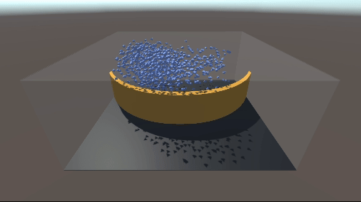
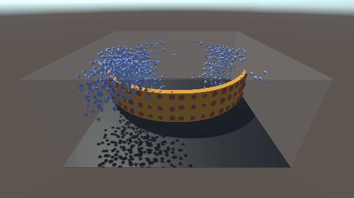
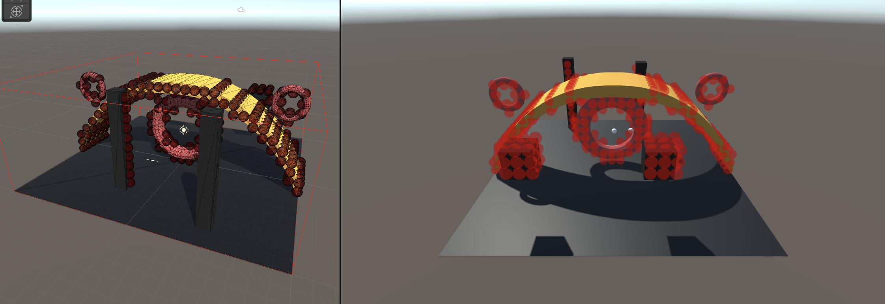
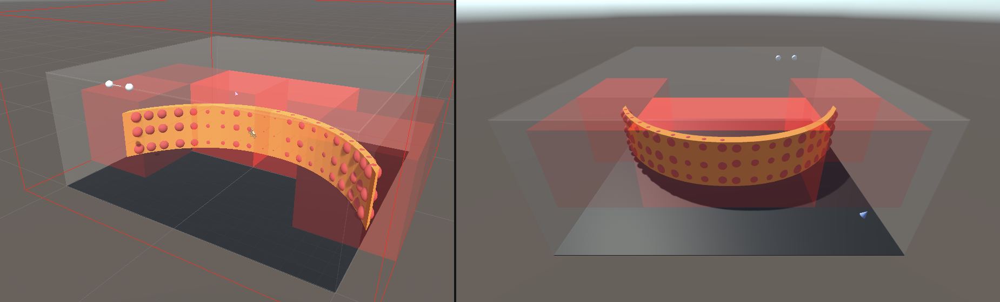

# Session notes

## Session 2024-11-9: Breakdown of the code

**Objectives:** Identify and be able to answer
- What the entry point?
- How is the communication between the CPU and the GPU being handle? (Back and forward)
- How are they handling obstacle avoidance?
- Whats the breaking point of the system in terms of number of boids?
- What/where is the potential bottle neck?

### Entry points:
- Spwner, then boid, then manager

### CPU - GPU
- BoidManager prepares a buffer with a copy of all boids and sends to the GPU
- BoidCompute computes neighbours and accumulators
- BoidManager reads back and passes accumulator to each boid
- Each boid updates the steering forces

### Obstacle avoidance
- Sphere Casting along a ray, physics engine. Is casts 300 rays in front. Potential complexity is $$O(r*m)$$ where $$r$$ are the ray and $$m$$ the colliders to check for
- This is a potential bottle neck as it might have a time complexity of $$O(n*r*m)$$ where $$n$$ are the boids.

### Evaluation
$$n$$ Boids count, without collision avoidance. (The boids flew away, as expected)

| $$n$$ |   fps     |
|    --:|        --:|
| 100   |   ~450    |
| 1000  |   ~150    |
| 10000 |    ~15    |

$$n$$ Boids count, with Sebastian's CPU collision avoidance, no spatial data structure.

| $$n$$ |   fps     |
|    --:|        --:|
| 100   |   ~250    |
| 1000  |   ~100    |
| 10000 |     ~9    |

Obstacle avoidance is definitely a bottleneck.

*Boid-based obstacle avoidance, "ObstacleProbe"*
Baseline 6 colliders as walls.

$$n$$ Boids count, with 60 boid-based obstacle probes in CPU, 1920x1080
Many Boid leaks (not memory leaks, tho, XD) can be seen at $$n = 1000$$.

$$n$$ Boids count, with 60 manually placed boid-based obstacle probes, computing forces in GPU, no spatial data structure 

| $$n$$ |   fps     |
|    --:|        --:|
| 100   |   ~ 285   |
| 1000  |    ~ 50   |
| 10000 |     ~ 2   |

**Side-by-side comparison CPU original (right), GPU(left)**

    
    

*The red spheres on the yellow arc are the manually placed probes.

### Updates - Adding Voxelization

- Added Acerola's voxelizer to the scene.

#### Next Steps:
- Use the positions of the voxels as static boids to create obstacles.
- Implement spatial hashing

## Session 2024-11-10: Hashing obstacles at build time

**Objective and questions:** Spatially hash the obstacle probes and shade the voxels by the number of obstacles they contain.
- Where is the hash table stored?
- How many supporting data structures do we need to book-keep the obstacles?
- What needs to be sent to the GPU, and how many times?

### 📌 IMPORTANT
- ALWAY keep track of what information the GPU needs. The GPU know nothing about the CPU world. I was constantly trying to hash a buffer with vector that I never set.

### Bug
- The current state is crashing.
- Tried to implement Pozzer's work, but the kernel crashes Unity.
- Commented the las two fors.
- A good thing is that the pivots usage is updating.

[1] C. T. Pozzer, C. A. de Lara Pahins, and I. Heldal, “A hash table construction algorithm for spatial hashing based on linear memory,” in Proceedings of the 11th Conference on Advances in Computer Entertainment Technology, in ACE ’14. New York, NY, USA: Association for Computing Machinery, Nov. 2014, pp. 1–4. doi: 10.1145/2663806.2663862.